# Dhaka Tesla Pool

> Share a seat. Split the fare. Survive Dhaka traffic.

A ride-pooling MVP for Dhaka's three-wheeled "Teslas". Passengers book a seat on a fixed line out of Banani;
a driver accepts them into one shared trip; seats can never be oversold; and each passenger pays their own
fare, 25% cheaper on distance when they share.

| | |
|---|---|
| **Live app** | https://dhaka-tesla-pool-7eai2wxhp-tesla-080d.vercel.app |
| **Live API** | https://dhaka-tesla-api.onrender.com ([`/health`](https://dhaka-tesla-api.onrender.com/health)) |
| **Demo video** | **https://youtu.be/mBr3ggwr4QQ** (6 min: the problem, how it was engineered, product tour) |
| **Demo logins** | `nusrat@`, `rafiq@`, `shirin@` (passengers) and `jashim@` (driver of Bullet) `dhakatesla.test`, password `tesla1234`, or tap a name on the sign-in page |

> The API runs on Render's free tier and **sleeps after 15 minutes idle**. The first request after that takes
> 30–60 s. Open `/health` once before a demo.

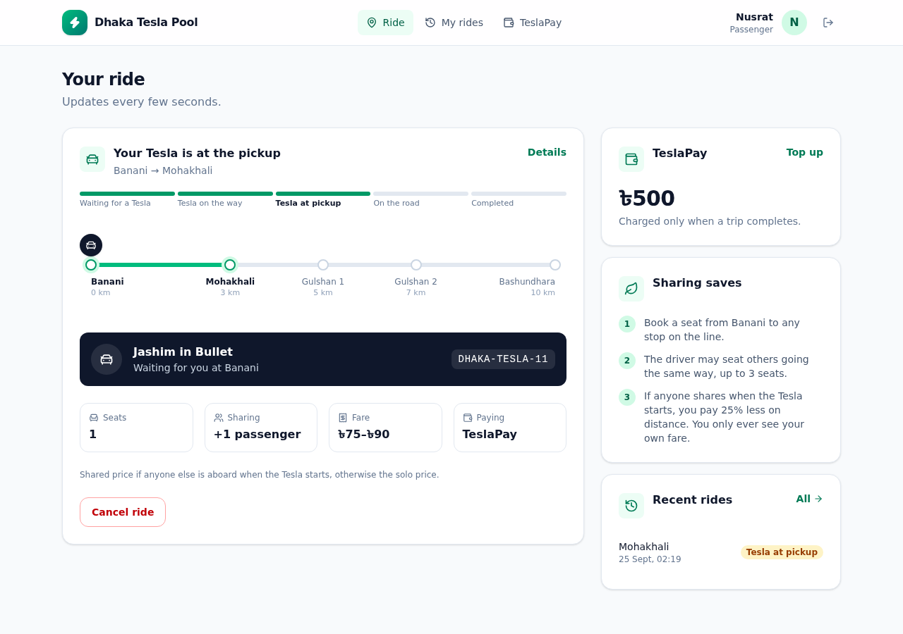

---

## Contents

1. [The problem](#the-problem)
2. [What it does](#what-it-does)
3. [Screenshots](#screenshots)
4. [Architecture](#architecture)
5. [Database](#database)
6. [How the rules work](#how-the-rules-work) (lifecycle, matching, fares, no endless waiting)
7. [Concurrency: the last seat](#concurrency-the-last-seat)
8. [Tech stack and why](#tech-stack-and-why)
9. [Project structure](#project-structure)
10. [Running it](#running-it) (Docker, local development, tests)
11. [Environment variables](#environment-variables)
12. [API overview](#api-overview)
13. [Deployment](#deployment)
14. [Assumptions](#assumptions)
15. [Trade-offs, limitations and next steps](#trade-offs-limitations-and-next-steps)
16. [If Oi Tesla goes viral (scaling)](#if-oi-tesla-goes-viral)
17. [Git workflow](#git-workflow)
18. [AI usage](#ai-usage)

---

## The problem

8:41 AM, Banani Road 11. Jashim's three-seat Tesla, **Bullet**, is waiting. Nusrat wants Mohakhali, Rafiq wants
Gulshan 1, and Shirin tries for the last seat half a minute later. The app has to decide quickly and fairly who
shares Bullet, make sure three seats never become four, charge each person their own fair price, show Jashim
exactly who is riding, and keep enough history to explain afterwards what happened.

## What it does

**Passengers** (Nusrat, Rafiq, Shirin)
- Sign up / sign in. New passengers get a TeslaPay wallet (starting at ৳0; the seeded cast has ৳500).
- Book a seat from Banani to any later stop, for 1–3 seats, paying cash or TeslaPay. The shared and solo prices
  are shown before booking.
- Refused straight away, with the reason, if no Tesla is online or none has enough free seats.
- Follow the ride live (updates every 5 s): waiting (with a 5-minute countdown) → Tesla on the way → at
  pickup → on the road → completed. The route diagram shows where the Tesla is.
- See their own fare and a count of co-riders, but never who they are or what they pay.
- Cancel free of charge until the Tesla starts.
- History with totals and a line-by-line receipt and timeline for every ride; the TeslaPay balance, top-up and
  ledger.

**Drivers** (Jashim with Bullet)
- Sign up with their Tesla (name, plate, 1–3 seats, fixed after sign-up) and go online or offline. Going
  offline is refused mid-trip.
- See waiting passengers who fit the free seats, each with the time left before their request expires, and
  accept them into one shared trip.
- See the trip on the route: who gets off where, seats taken, and one button for the next step (arrive →
  start → complete), or cancel with a reason.
- After completing: earnings, and whom to collect cash from. Earnings history.

**The system**
- Seats are never oversold, including under simultaneous accepts (row locks, conditional updates, database
  constraints).
- Every status change is written to an append-only history table with who did it and why.
- Fares are integer poisha, fixed when the Tesla starts, and charged in the same transaction that completes the trip.
- A request nobody accepts within 5 minutes expires, and the passenger is told.

## Screenshots

| | |
|---|---|
| 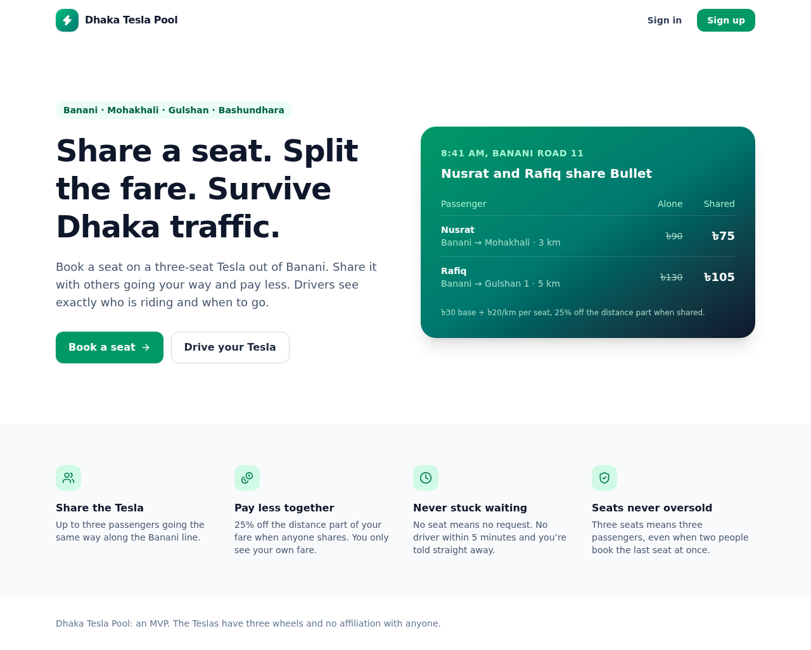 Landing | 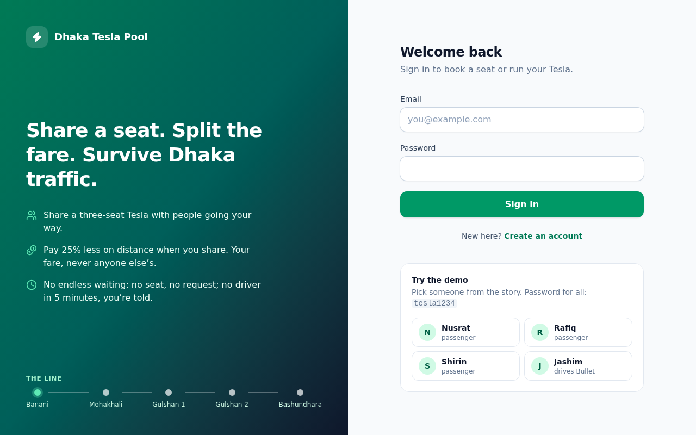 Sign in, with demo accounts |
| 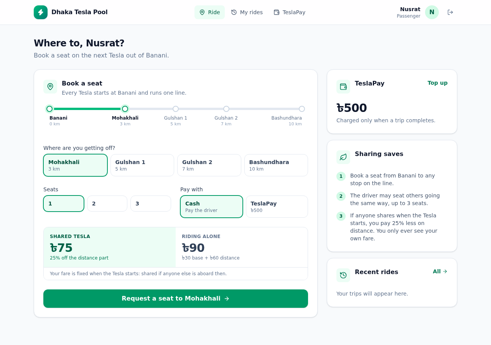 Booking: shared vs solo price |  Nusrat's live ride, shared with one other |
| 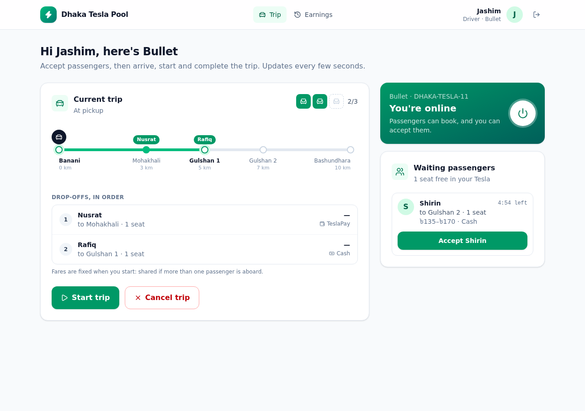 Jashim: Nusrat and Rafiq aboard, Shirin waiting | 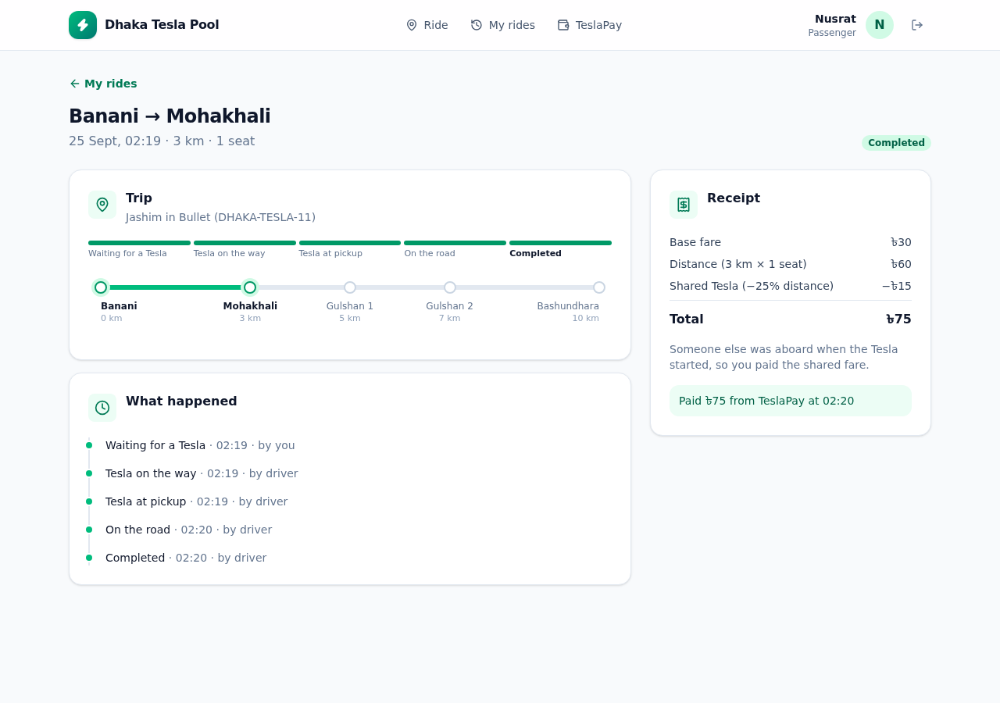 Receipt: ৳30 + ৳60 − ৳15 = ৳75 |
| 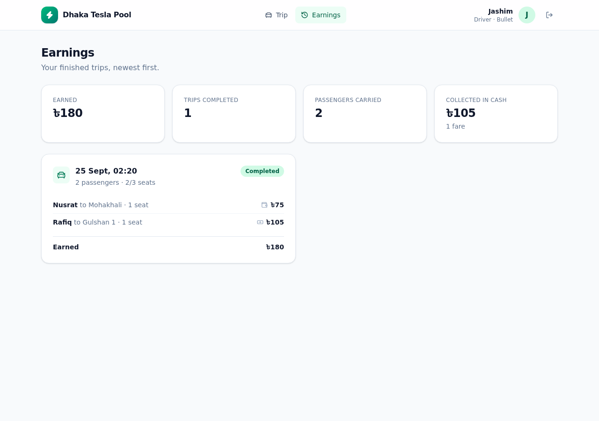 Jashim's earnings | 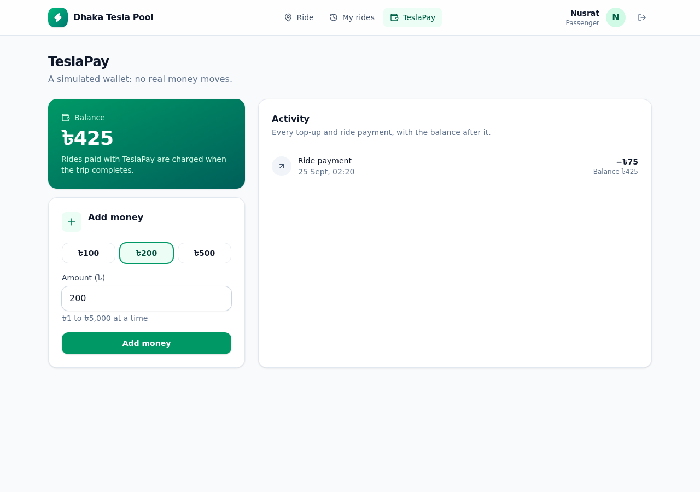 TeslaPay wallet |

Phone layout (passenger and driver): 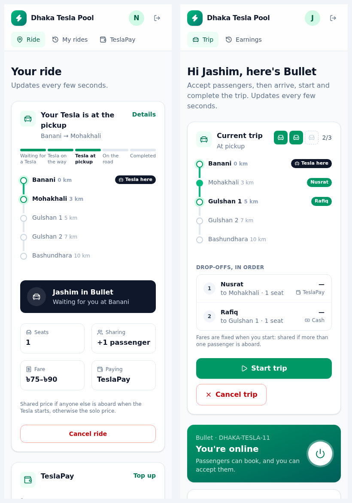

## Architecture

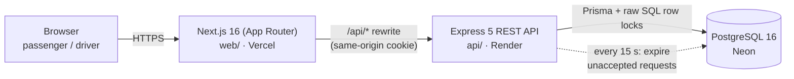

- The **browser only talks to Next.js**. `/api/*` is rewritten to Express, so the httpOnly session cookie is
  first-party (`SameSite=Lax`) even though web and API are on different hosts, and CORS never comes into play.
- **Express** layers: `routes → controller → service → Prisma`, with the rules in `domain/` as pure
  functions (fare, state machines, route, matching) that are unit-tested without a database.
- **Postgres** is the single source of truth, and it also enforces the invariants (CHECKs, partial unique
  indexes). No Redis, queues or microservices: one API process and one database comfortably carry the MVP, and
  each would add operational cost with no benefit yet.
- Live status is **polling every 5 s** (SSE or WebSockets are the scale-up path, see [scaling](#if-oi-tesla-goes-viral)).

More detail: [docs/architecture.md](docs/architecture.md) · rules: [docs/domain-rules.md](docs/domain-rules.md).

## Database

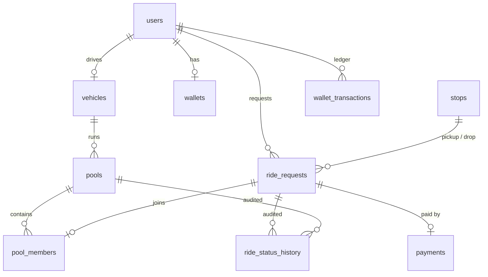

| Table | Why it exists |
|---|---|
| `users` | Passengers and drivers, with a `role` enum. Emails are unique and lower-case (CHECK). |
| `vehicles` | A driver's Tesla, one per driver. `capacity` is `CHECK 1–3`, with no endpoint to change it. |
| `stops` | The one route line, ordered by `sequence`; fare distance = the drop's `distance_from_start_m`. |
| `pools` | One Tesla's shared trip. `seats_occupied` is the capacity counter: `CHECK 0 ≤ seats_occupied ≤ capacity`. Partial unique index: **one active pool per Tesla**. |
| `pool_members` | Which ride is in which pool; `left_at` is set when a passenger cancels, so the row stays as history. |
| `ride_requests` | One passenger's ride: trip, seats, status, both estimates, and the fare breakdown frozen at start. Partial unique index: **one active ride per passenger**. |
| `ride_status_history` | Append-only: every transition of every ride and pool, with actor and reason. |
| `wallets` / `wallet_transactions` | Simulated TeslaPay: balance (`CHECK ≥ 0`) plus a signed ledger with the balance after each entry. |
| `payments` | One per completed ride: method and amount. |

Full ERD with columns: [docs/architecture.md](docs/architecture.md#database-erd). The hand-written constraints are
at the end of [the first migration](api/prisma/migrations/20260923202245_init/migration.sql).

**Money** is stored as **integer poisha** (৳1 = 100 poisha). Floats can't represent 0.1 exactly, so sums drift.
`NUMERIC` would be exact but is slower and awkward in JavaScript (it comes back as a string or a Decimal). Integers
are exact and fast, and the only rounding step in the model is the pool discount.

## How the rules work

### Lifecycle: two state machines

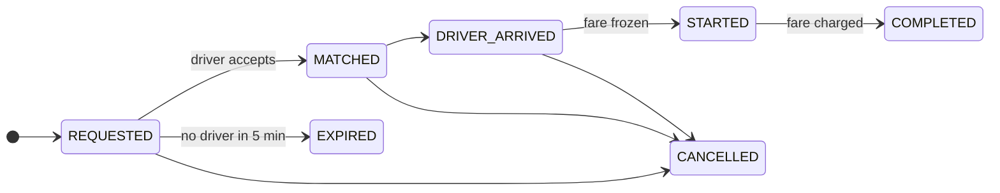

The suggested lifecycle is split into **two machines**: the passenger's **ride request** (above) and the Tesla's
**pool** (`MATCHED → DRIVER_ARRIVED → STARTED → COMPLETED`, or `CANCELLED`). The reason: Nusrat has to be
able to cancel without cancelling Jashim's trip for Rafiq. Pool actions move every passenger still in the pool,
in one transaction. Any transition not in the tables returns `409 INVALID_TRANSITION` and changes nothing.
There's a test for every from→to pair.

`EXPIRED` was added as its own terminal state rather than reusing `CANCELLED`, because nobody cancelled the
ride: the system gave up on it, and history and reports should show that.

### Geography and matching

All Teslas run **one predefined line**, and everyone boards at the start:

| Banani | Mohakhali | Gulshan 1 | Gulshan 2 | Bashundhara |
|---|---|---|---|---|
| 0 km | 3 km | 5 km | 7 km | 10 km |

Because every trip is on the same line, any two passengers are going the same way, so drop-offs are **never compared**:
Nusrat can get off at the next stop and Shirin at the last. A request can join a Tesla's trip when **the trip
hasn't started and its seats fit**. The driver accepts each request; the first accept creates the trip.

### Fares

```
distanceCharge = distanceKm × ৳20 × seats
poolDiscount   = 25% of distanceCharge, if anyone else is aboard when the Tesla starts
fare           = ৳30 base + distanceCharge − poolDiscount
```

| Passenger | Trip | Alone | Shared |
|---|---|---|---|
| Nusrat | Banani → Mohakhali, 3 km | 30 + 60 = **৳90** | 30 + 60 − 15 = **৳75** |
| Rafiq | Banani → Gulshan 1, 5 km | 30 + 100 = **৳130** | 30 + 100 − 25 = **৳105** |
| Shirin | Banani → Gulshan 2, 7 km | 30 + 140 = **৳170** | 30 + 140 − 35 = **৳135** |

The fare is **frozen when the Tesla starts**: shared if more than one passenger is aboard at that moment. If Rafiq
cancels before the start, Nusrat pays ৳90. It's **charged at completion**, in the same transaction that
completes the trip. TeslaPay rides need a balance covering the solo fare (the maximum possible) when booking.

### Nobody waits forever

- **Refused up front:** booking returns `409 NO_TESLA_AVAILABLE` and creates nothing if no Tesla is online, every
  Tesla is full or moving, or none has enough free seats ("No Tesla has 2 free seats right now (at most 1)").
- **Expired after 5 minutes:** a request nobody accepts becomes `EXPIRED`, the passenger sees why, and can book
  again. A sweeper in the API process checks every 15 s, and accept refuses overdue requests in between, so
  the limit holds to the second.

Complete rules, including authorization and cancellation: [docs/domain-rules.md](docs/domain-rules.md).

## Concurrency: the last seat

**The scenario:** Bullet has one seat left (Rafiq holds 2 of 3). Nusrat and Shirin are both waiting, and Jashim's
two accepts land at the same instant. Both read "1 seat free".

**How it's handled now:** each accept is one transaction ([`acceptRequest`](api/src/modules/driver/driver.service.ts)):

1. `SELECT … FROM vehicles WHERE driver_id = $1 FOR UPDATE` locks **Bullet's row**. The second accept waits
   until the first commits, then sees the updated seat count. The lock is on the **vehicle**, not the pool,
   because the vehicle row exists before the first pool does: locking "the active pool" would lock nothing
   when two accepts race to create it.
2. `SELECT … FROM pools WHERE id = $p FOR UPDATE` also locks the pool row, because a passenger cancelling locks
   only the pool.
3. `UPDATE pools SET seats_occupied = seats_occupied + n WHERE id = $p AND seats_occupied + n <= capacity`. If no row
   is updated, the response is `409 CAPACITY_EXCEEDED`.
4. `UPDATE ride_requests SET status = 'MATCHED' WHERE id = $r AND status = 'REQUESTED'`. If the passenger just
   cancelled (or the request expired), nothing is updated, and the whole transaction, including the seats,
   rolls back.
5. **The database guards the result regardless of the code:** `CHECK (seats_occupied <= capacity)`, one active pool
   per Tesla, and one active ride per passenger (partial unique indexes).

Every writer locks in the same order, **vehicle → pool → ride**, so two transactions can wait for each other but
never deadlock. Passenger cancels lock pool → ride and use a conditional update on the status they read,
retrying if it changed.

**Tested, not just claimed:** [`pooling.test.ts`](api/tests/integration/pooling.test.ts) fires the racing requests
with `Promise.all` for the last seat, three first accepts on an empty Tesla, and cancel-vs-accept. Each test asserts that
`seats_occupied` equals the sum of the members' seats. Running them with the `FOR UPDATE`s removed showed which
layer does what: the conditional seat `UPDATE` alone still stopped the last-seat overbooking, but the
first-accept race then failed with a 500 on the unique index instead of a clean `409`. That's why both layers stay.

**At larger scale** (more in the [scaling section](#if-oi-tesla-goes-viral)): the vehicle lock is already per
Tesla, so contention stays local. Next steps would be idempotency keys on accept and booking, splitting the
database by area, and moving matching to a per-area worker so a hot area can't slow the rest.

## Tech stack and why

Mandated: **Next.js / React** frontend, **Node.js** backend. Everything else is a choice:

| Area | Picked | Realistic alternatives | Why it fits this MVP | What would make me switch |
|---|---|---|---|---|
| Backend framework | **Express 5** (TypeScript) | NestJS, Fastify | Small and explicit: every line can be read and defended. Express 5 forwards async errors to the error handler natively. The app's structure (routes → controller → service → domain) is ours and visible. | A much larger team or codebase needing enforced modules and DI (NestJS), or measured throughput limits (Fastify). |
| API style | **REST** | GraphQL, tRPC | A handful of resources (rides, pools, wallet) with clear state-changing actions; trivial to test with Supertest; plain HTTP caching later. | Many clients needing differently shaped views of the same data (GraphQL). |
| Database | **PostgreSQL 16** | MySQL, SQLite, MongoDB | Capacity is a consistency problem: row locks, CHECK constraints, partial unique indexes and transactions are exactly what's needed. | Nothing soon. For scale: read replicas, partitioning, or PostGIS for real geography. |
| Data access | **Prisma 7** (+ raw SQL for locks) | Drizzle, Knex, raw `pg` | Typed queries, migrations and seeding in one tool. Locks and the expiry statement drop to raw SQL where precision matters. | If most queries became hand-tuned SQL, a thinner layer (Kysely or Knex) would get in the way less. |
| Validation | **Zod 4** | Joi, Yup, class-validator | One schema gives parsing, types and readable field errors that the UI shows under each input. | — |
| Auth | **JWT in an httpOnly cookie** + bcrypt (bcryptjs) | Server sessions in a table, OAuth provider, token in localStorage | Stateless; JavaScript can't read the cookie (XSS can't steal it); `SameSite=Lax` blocks cross-site POSTs; same-origin through the Next.js rewrite. bcryptjs is pure JS, so the Docker image needs no native build. | Needing instant revocation or "log out everywhere" (server sessions), or social login (OAuth). |
| Frontend | **Next.js 16 App Router** | React + Vite SPA | Recommended by the brief; its rewrites give the same-origin cookie for free; `proxy.ts` guards routes before render. | — |
| Styling | **Tailwind CSS 4** + **lucide-react** icons | CSS Modules, component kits (shadcn/ui, MUI) | Fast to build a consistent, responsive UI without a component library to justify. Lucide icons are tree-shaken per icon. | A design system shared across products (a component library). |
| Live updates | **Polling (5 s)** | SSE, WebSockets | Works everywhere, including free hosting that drops long connections; simple to reason about. | Many concurrent riders or sub-second needs, e.g. live driver location (SSE or WebSockets). |
| Tests | **Vitest + Supertest** on a real Postgres | Jest, mocked database | Concurrency and constraint behaviour only exist in a real database. Vitest is fast with TypeScript and ESM out of the box. | — |
| Logging | **pino** + request ids | winston, console | Structured JSON, cheap, redacts cookies; every response carries `X-Request-Id`. | Shipping to a log platform (pino transports). |
| Hosting | **Vercel** (web), **Render** (API, Docker), **Neon** (Postgres), all free | Railway, Fly.io, one VPS | Free tiers, deploy from Git, managed TLS. The API ships the same Docker image as `docker compose`. | Cold starts and sleep become unacceptable (paid tier or one small VPS running `docker compose`). |

## Project structure

```
.
├── api/                         Express + Prisma REST API
│   ├── prisma/
│   │   ├── schema.prisma        tables, enums, relations
│   │   ├── migrations/          SQL migrations (+ hand-written CHECKs and partial indexes)
│   │   ├── seed-data.ts         route stops + story cast (used by seed and tests)
│   │   └── seed.ts
│   ├── src/
│   │   ├── domain/              pure rules: fare, rideStateMachine, route, matching
│   │   ├── modules/             auth, stops, fares, rides (+ expiry), driver, pools, wallet, health
│   │   │   └── */               *.routes.ts → service.ts (transactions, locks) → presenter.ts (response shape)
│   │   ├── middleware/          auth guards, validate (Zod), errors, rate limit, request logger
│   │   ├── lib/                 prisma, locks, session (JWT), errors, logger, password
│   │   ├── config/env.ts        environment validated at boot
│   │   └── app.ts · server.ts
│   ├── tests/unit/              domain rules, middleware
│   ├── tests/integration/       HTTP + real Postgres: auth, rides, pooling, trip, payments, expiry…
│   └── Dockerfile · docker-entrypoint.sh
├── web/                         Next.js 16 frontend
│   ├── src/app/                 (auth)/login, register · passenger/* · driver/* · landing
│   ├── src/components/          ui, route (RouteLine), ride, driver, layout, auth, brand
│   ├── src/lib/                 api client, types, formatting · src/hooks/ useApi (polling), useCountdown
│   ├── src/proxy.ts             redirects to /login without a session
│   ├── next.config.ts           /api/* → API rewrite, standalone output
│   └── Dockerfile
├── docs/                        architecture.md, domain-rules.md, scaling.md, screenshots/
└── docker-compose.yml · .env.example
```

## Running it

### Prerequisites
- **Docker** with Compose v2 (that's all you need to run it).
- For local development: **Node 24** (`nvm use` reads `.nvmrc`) and **npm 11**. Prisma 7 doesn't support Node 23,
  and npm 10.9 fails to install vitest.

### With Docker (recommended)

```bash
git clone https://github.com/Bishal05das/Dhaka-Tesla-Pool.git
cd Dhaka-Tesla-Pool
docker compose up --build
```

Open **http://localhost:3000** and sign in as anyone from the cast (password `tesla1234`). No `.env` is needed,
because every setting has a default. On start the API **applies migrations and seeds** the stops and the cast. The seed
only upserts, so restarts are safe.

| Service | URL |
|---|---|
| Web | http://localhost:3000 |
| API | http://localhost:4000 (`/health`) |
| Postgres | `localhost:5440` (`tesla` / `tesla` / `dhaka_tesla`) |

- **Port already in use?** Copy `.env.example` to `.env` and set `WEB_HOST_PORT` (e.g. `3001`), `API_HOST_PORT`
  or `DB_HOST_PORT`.
- **Fresh demo data:** `docker compose down -v && docker compose up -d` (deletes all data and reseeds the cast).
- **Try the pooling story:** sign in as Jashim and go online. Book as Nusrat and Rafiq, accept both, then watch
  Shirin get refused when Bullet is full. Each person needs a separate browser or browser profile, because all
  tabs (and all private windows) of one browser share one sign-in.

### Local development

```bash
nvm use
docker compose up -d db                      # just Postgres

cd api
cp .env.example .env
npm install                                  # also generates the Prisma client
npm run db:migrate                           # apply migrations
npm run db:seed                              # stops + story cast
npm run dev                                  # http://localhost:4000

cd ../web                                    # in another terminal
cp .env.example .env.local                   # API_INTERNAL_URL=http://localhost:4000
npm install
npm run dev                                  # http://localhost:3000
```

### Tests

```bash
docker compose up -d db
cd api && npm test                           # 228 tests in 20 files, ~40 s
```

Tests run against a separate **`dhaka_tesla_test`** database. It's created and migrated on the first run
(`migrate deploy`, never a destructive reset), and each file truncates and reseeds it. The helpers refuse any
database whose name doesn't end in `_test`. Frontend checks: `cd web && npm run typecheck && npm run lint`.

What the tests cover (all using the story cast):

| Required by the brief | Where |
|---|---|
| Bullet's capacity can never be exceeded | `pooling.test.ts` (4th seat → 409; DB CHECK refuses direct overbooking), `matching.test.ts` |
| Invalid state transitions are rejected | `rideStateMachine.test.ts` (every from→to pair), `trip.test.ts` (start before arrive, cancel once moving… nothing changes) |
| Nusrat's and Rafiq's pooled fares calculate correctly | `fare.test.ts` (৳90/৳75, ৳130/৳105, multi-seat, rounding), `trip.test.ts` (frozen at start, solo if a co-rider cancels) |
| Users can't modify another user's ride | `rides.test.ts` (Rafiq can't read or cancel Nusrat's ride → 404), role checks → 403 |
| Cancellation rules hold | `rides.test.ts` (free until start, frees seats, last one out cancels the pool, double cancel frees once) |
| Concurrent requests can't corrupt pool capacity | `pooling.test.ts` (last seat, racing first accepts, cancel-vs-accept), `payments.test.ts` (double complete charges once) |

Plus: auth (cookie flags, same error for wrong password and unknown email, rate limit), request refusal and
expiry, wallet debits and the ledger, and proxy trust.

## Environment variables

Root [`.env.example`](.env.example) (Docker Compose). Everything has a default in `docker-compose.yml`:

| Variable | Default | Purpose |
|---|---|---|
| `POSTGRES_USER` / `POSTGRES_PASSWORD` / `POSTGRES_DB` | `tesla` / `tesla` / `dhaka_tesla` | Local database credentials (demo only). |
| `DB_HOST_PORT` / `API_HOST_PORT` / `WEB_HOST_PORT` | `5440` / `4000` / `3000` | Host ports. |
| `JWT_SECRET` | a local demo value | Session signing key, **32+ chars**. Use `openssl rand -hex 32` anywhere shared. |
| `JWT_TTL_HOURS` | `12` | Session length. |
| `COOKIE_SECURE` | `false` | `true` when served over HTTPS. |
| `CORS_ORIGIN` | `http://localhost:3000` | Origins allowed to call the API directly (the web app goes through its rewrite). |
| `AUTH_RATE_LIMIT_MAX` | `20` | Sign-up + login attempts per IP per 15 min. |
| `REQUEST_TIMEOUT_SECONDS` | `300` | How long a request waits for a driver before expiring. |
| `TRUST_PROXY` | `0` | Proxy hops whose `X-Forwarded-For` is trusted: `0` in Compose, `2` for Vercel → Render. |
| `SEED_ON_START` | `true` | Run the idempotent seed on every API start. |
| `LOG_LEVEL` | `info` | pino log level. |

Also: [`api/.env.example`](api/.env.example) (API outside Docker, adds `DATABASE_URL`) and
[`web/.env.example`](web/.env.example) (`API_INTERNAL_URL`, read **at build time**). Real `.env` files are
gitignored, and no secrets are committed.

## API overview

REST, JSON, all under `/api`. The session is the `dt_session` cookie. Errors are always
`{ "error": { "code", "message", "details" } }`.

| Method | Path | Who | Purpose |
|---|---|---|---|
| POST | `/api/auth/register` | public | Sign up as a passenger, or as a driver with `vehicle { name, plate, capacity }` |
| POST | `/api/auth/login` · `/api/auth/logout` | public | Set / clear the session cookie (rate limited) |
| GET | `/api/auth/me` | signed in | Current user (+ Tesla for drivers) |
| GET | `/api/stops` | signed in | The route line in order |
| POST | `/api/fares/estimate` | passenger | Solo and shared prices for a trip |
| POST | `/api/rides` | passenger | Book: `{ pickupStopId, dropStopId, seats, paymentMethod }` |
| GET | `/api/rides` · `/api/rides/:id` | passenger | Own rides; one ride with its timeline (someone else's → 404) |
| POST | `/api/rides/:id/cancel` | passenger | Cancel before the Tesla starts `{ reason? }` |
| GET | `/api/wallet` · POST `/api/wallet/topup` | passenger | TeslaPay balance and ledger; simulated top-up |
| PATCH | `/api/driver/status` | driver | `{ online }` (refused mid-trip) |
| GET | `/api/driver/requests` | driver | Waiting requests that fit the free seats |
| POST | `/api/driver/requests/:id/accept` | driver | Accept into the Tesla's trip (creates it if needed) |
| GET | `/api/driver/pool` · `/api/driver/history` | driver | Current trip; finished trips with earnings |
| POST | `/api/pools/:id/arrive` · `start` · `complete` · `cancel` | driver | Move the trip along |
| GET | `/health` | public | Liveness + database check (503 if the DB is unreachable) |

| Status | Code examples |
|---|---|
| 400 | `VALIDATION_ERROR` (with field details) |
| 401 / 403 | `UNAUTHENTICATED` / `FORBIDDEN` (wrong role) |
| 404 | `NOT_FOUND`, also for someone else's ride, so ids can't be probed |
| 409 | `INVALID_TRANSITION`, `CAPACITY_EXCEEDED`, `NO_TESLA_AVAILABLE`, `INSUFFICIENT_BALANCE`, `CONFLICT` |
| 429 | `RATE_LIMITED` |

## Deployment

| Part | Host (free) | Setup |
|---|---|---|
| Web | **Vercel** | Root directory `web`, preset Next.js, env `API_INTERNAL_URL=https://dhaka-tesla-api.onrender.com` (set **before** building). |
| API | **Render** Web Service, Docker, Singapore | Root directory `api`, health check `/health`, env `DATABASE_URL`, `JWT_SECRET`, `COOKIE_SECURE=true`, `CORS_ORIGIN=<vercel url>`, `TRUST_PROXY=2`, `SEED_ON_START=true`. Migrations run on every start. |
| Database | **Neon** Postgres 16, Singapore | Direct (non-pooled) connection string with `sslmode=require` for Prisma migrations. |

Free-tier constraints: the Render API sleeps when idle (cold start of about 30–60 s), and the Vercel link above points
to one specific build. Anyone can reproduce the whole stack with `docker compose up`.

## Assumptions

Documented where the brief left room ([docs/domain-rules.md](docs/domain-rules.md#assumptions) has the full list):

1. **One route line**, Banani → Bashundhara, and everyone boards at Banani. Drop-offs are never compared,
   because everyone is going the same way.
2. The **driver accepts each passenger**. Joining is allowed until the Tesla starts, including after it has arrived.
3. The fare is **frozen at start** (shared if anyone else is aboard then) and **charged at completion**.
4. **Seats** multiply the distance charge; the base fare is charged once.
5. **Cancellation is free until start**; after that nobody can cancel. The driver can cancel the whole trip
   before start.
6. Requests that no Tesla can seat are **refused**; unaccepted requests **expire after 5 minutes**.
7. One Tesla per driver, one active trip per Tesla, one active ride per passenger. Capacity 1–3, fixed at sign-up.
8. Co-riders are anonymous to each other; the driver sees names, seats and drop-offs.
9. New passengers start with **৳0** TeslaPay; the seeded cast starts with ৳500. Top-ups are simulated.

## Trade-offs, limitations and next steps

**Key decisions and trade-offs**
- **Locks in Postgres rather than a distributed lock or queue:** correct and simple for one database; the
  contention is per Tesla. The cost is that it's tied to one primary database.
- **Two state machines** instead of one: more code, but a passenger's cancel and the Tesla's progress don't
  interfere with each other.
- **Polling** instead of push: up to 5 s of staleness, in exchange for working on free hosting with no connection management.
- **An in-process expiry sweeper and rate limiter:** no extra infrastructure. Both are safe with several instances
  (the sweep is a conditional update), but the rate-limit counter isn't shared between instances.
- **The fare is frozen at start, not at acceptance:** fair to whoever actually shared, but the passenger sees a
  range until the Tesla starts.

**Known limitations**
- One route, boarding only at the start; no real map or GPS (the Tesla's position is inferred from the trip status).
- The driver can't remove a single passenger (only cancel the whole trip); no ratings or refunds.
- Behind Docker Compose, the login rate limit sees every visitor as the web container (`TRUST_PROXY=0` is safe
  but coarse). A real self-hosted setup would put nginx or Caddy in front to set `X-Forwarded-For`.
- No automated browser tests; the UI was verified by driving it in headless Chrome during development.
- Free-tier cold starts; the API image is about 550 MB (mostly the Prisma CLI, which it needs for migrations).

**Next improvements**
- Board and alight at any stop (the `pickup_stop_id` column is already there); several lines.
- Push updates (SSE) and live driver location.
- Idempotency keys on booking and accept; a shared rate-limit store for multiple instances.
- Playwright end-to-end tests in CI (GitHub Actions) on every pull request.
- Driver removes a no-show passenger; ratings; refunds for driver cancellations.

## If Oi Tesla goes viral

Reasoning for 1M passengers and 100k drivers: [docs/scaling.md](docs/scaling.md).

## Git workflow

- **Long-lived branches:** `master` (integrated features), `pre-release` (integration fixes, docs, deployment checks),
  `release/v1.0.0` (the version deployed and shown in the video, tagged `v1.0.0`).
- **Feature branches**, merged into `master` with `--no-ff` so each feature stays visible in the history:
  - Setup: `architecture-docs`, `api-scaffold`, `database-schema`, `docker-setup`
  - API: `auth`, `fare-engine`, `ride-requests`, `driver-flow`, `tesla-pooling`, `trip-lifecycle`,
    `payments-wallet`, `request-expiry`
  - Web: `web-scaffold`, `passenger-ui`, `driver-ui`, `web-docker`, `ui-redesign`
- **Commits:** `<type>(<scope>): description`, one logical change each; the bodies explain why.
- The history shows the actual process, including what went wrong, e.g.
  `fix(api): accept bodiless POSTs on endpoints with optional bodies` (caught by a test) and
  `fix(api): trust only the proxies actually in front of the api` (found while checking the deployment).

## AI usage

_Draft for the author to review and put in their own words._

**Tools:** Claude Code (Anthropic), used throughout: turning the brief into a plan, and asking clarifying
questions before any code; designing the schema, state machines and locking; writing code and tests; checking
the UI in headless Chrome; and drafting this README. Every design decision was confirmed by me, and the
assumptions above are my answers to questions the AI asked rather than guesses it made.

**An accepted suggestion:** locking the **vehicle row** rather than the pool row when accepting a passenger. The first
design locked the pool, but that locks nothing when two accepts race to create the first pool. The AI proposed
the vehicle lock and then showed the difference by running the race tests with the locks removed (the
first-accept race failed; the last-seat race was still caught by the conditional update). I kept both layers.

**A rejected or changed suggestion:** matching. The AI's first plan matched passengers only if their drop-off
zones were "neighbours" of each other (e.g. Mohakhali ↔ Gulshan 1). I rejected that: in real pooling the drop-off
only has to lie on the route. One passenger can get off at the next stop and another at the last one. The
design became one predefined line, where only seats and trip status decide matching. Two other things were
changed at my request: drivers were originally seeded only, and I made them sign up with their Tesla; and
requests originally waited indefinitely, and I asked for refusal when no seat exists plus a timeout.

**What the AI got wrong and we fixed:** tests caught Express 5 rejecting bodiless POSTs; a deployment check
found the proxy-trust setting let the rate limit be bypassed. Both are in the commit history as `fix(...)`
commits. Prisma refused to let the AI run a destructive `migrate reset`, and the test setup was redesigned to use
`migrate deploy` plus per-test truncation instead.
