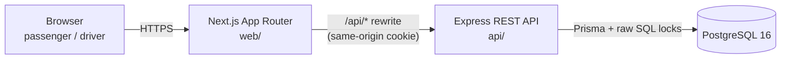
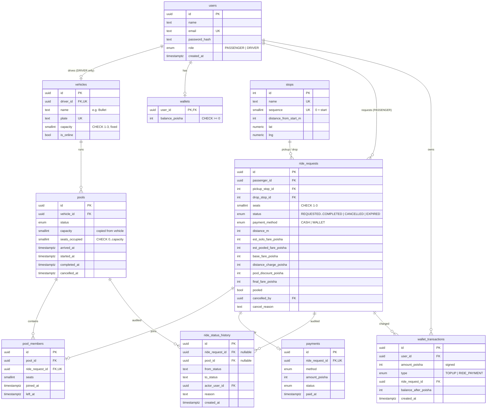

# Architecture

Business rules (lifecycle, fares, matching, concurrency) live in [domain-rules.md](domain-rules.md).

## System overview



| Layer | Tech | Hosting (free tier) | Local |
|---|---|---|---|
| Frontend | Next.js (App Router), TypeScript, Tailwind CSS | Vercel | `web` container |
| Backend | Node.js, Express, TypeScript, Zod, pino | Render | `api` container |
| Database | PostgreSQL 16 via Prisma | Neon | `db` container |

Deliberately **not** included: Redis, queues, microservices, WebSockets. One API process plus one
Postgres handles the MVP; Postgres row locks and constraints handle seat consistency (see
[domain-rules.md § Concurrency](domain-rules.md#concurrency-the-last-seat-problem)).

### Request flow

1. The browser only talks to Next.js. Next.js rewrites `/api/*` to the Express API
   (`http://api:4000` in Docker, the Render URL in production). The auth cookie is therefore
   first-party (`SameSite=Lax`) even though web and API are on different hosts.
2. Express authenticates the JWT from the httpOnly cookie, validates input with Zod, and calls a service.
3. Services own database transactions. Pure domain functions (fare, state machine, matching) hold the rules
   and have no database access, so they are unit-testable.
4. Status changes reach the screen by polling every ~5 s.
5. A timer inside the API process expires ride requests nobody accepted within 5 minutes
   (see [domain-rules.md § Nobody waits forever](domain-rules.md#nobody-waits-forever)).

Proxies: Express trusts exactly `TRUST_PROXY` hops of `X-Forwarded-For` when working out the visitor's address
for rate limiting. That's 2 on Vercel → Render (Vercel's edge sets the header, Render's balancer appends one
entry) and 0 under docker compose (self-hosted Next.js doesn't add the visitor, so the header can't be trusted).

### Backend layering

```
routes  →  controller  →  service  →  Prisma / raw SQL
                            │
                            └── domain/ (pure: fare.ts, rideStateMachine.ts, matching.ts)
```

- **routes**: URL, auth and role guards, Zod validation middleware.
- **controller**: maps HTTP to service calls; no business rules.
- **service**: transactions, locking, authorization on ownership, history writes.
- **domain**: pure functions, no I/O.

Cross-cutting: helmet, CORS allowlist, rate limiting on auth routes, request IDs, structured logging (pino),
central error handler, environment validation at boot, `GET /health` (checks the DB).

## Database (ERD)



### Why each table exists

| Table | Purpose |
|---|---|
| `users` | Passengers and drivers share one table with a `role` enum. Both sign up. |
| `vehicles` | A driver's Tesla. One per driver (`driver_id` unique). `capacity` is 1–3 and has no update endpoint. |
| `stops` | The single predefined route line, ordered by `sequence`. Fare distance = drop's `distance_from_start_m`. |
| `pools` | One shared trip of one Tesla. Holds the pool-level state and the seat counter that enforces capacity. |
| `pool_members` | Which ride request is in which pool, with join/leave times (a cancelled rider keeps a `left_at` row). |
| `ride_requests` | A passenger's ride: trip, seats, per-passenger status, estimate, and the frozen fare breakdown. |
| `ride_status_history` | Append-only log of every transition and who caused it — answers "what happened?" later. |
| `wallets` / `wallet_transactions` | Simulated TeslaPay: balance plus an append-only ledger. |
| `payments` | One payment record per completed ride, for cash or wallet. |

### Key constraints and indexes

- `pools`: `CHECK (seats_occupied BETWEEN 0 AND capacity)`; partial unique index on `vehicle_id`
  `WHERE status IN ('MATCHED','DRIVER_ARRIVED','STARTED')` — one active pool per Tesla.
- `ride_requests`: partial unique index on `passenger_id` for active statuses — one active ride per
  passenger (also makes "request ride" safe to retry); `CHECK (pickup_stop_id <> drop_stop_id)`;
  index `(status, created_at)` for the driver feed; index `(passenger_id, created_at DESC)` for history.
- `wallets`: `CHECK (balance_poisha >= 0)`.
- Money is always `INTEGER` poisha (৳1 = 100 poisha).

## API overview (REST)

| Method | Path | Role | Purpose |
|---|---|---|---|
| POST | `/api/auth/register` | public | Sign up as passenger, or as driver with `vehicle {name, plate, capacity}` |
| POST | `/api/auth/login` · `/api/auth/logout` | public | Set / clear auth cookie |
| GET | `/api/auth/me` | any | Current user |
| GET | `/api/stops` | any | The route line, in order |
| POST | `/api/fares/estimate` | passenger | Solo and pooled estimate |
| POST | `/api/rides` | passenger | Request a ride |
| GET | `/api/rides` · `/api/rides/:id` | passenger | Own history / one ride (own fare only; co-riders as a count) |
| POST | `/api/rides/:id/cancel` | passenger | Cancel own ride before STARTED |
| GET | `/api/wallet` · POST `/api/wallet/topup` | passenger | Simulated TeslaPay |
| PATCH | `/api/driver/status` | driver | Go online / offline |
| GET | `/api/driver/requests` | driver | Open requests that fit the remaining seats |
| POST | `/api/driver/requests/:id/accept` | driver | Accept into current pool (creates one if none) |
| GET | `/api/driver/pool` | driver | Current pool: members, seats, status |
| POST | `/api/pools/:id/arrive` · `start` · `complete` · `cancel` | driver | Pool lifecycle |
| GET | `/api/driver/history` | driver | Past pools |
| GET | `/health` | public | Liveness + DB check |

Errors: `{ "error": { "code", "message", "details" } }`: 400 validation, 401 unauthenticated,
403 wrong role, 404 not found **or not yours**, 409 invalid transition / capacity / no Tesla available /
insufficient balance / conflict, 429 rate limited.

**Why REST:** the app is a small set of resources (rides, pools, wallet) with clear state-changing actions.
REST maps onto that directly, is trivial to test with Supertest, and needs no extra schema tooling.
GraphQL would pay off with many clients needing different shapes of the same data, which this MVP doesn't have.
