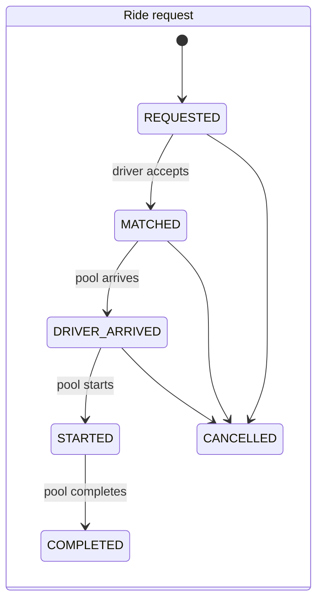
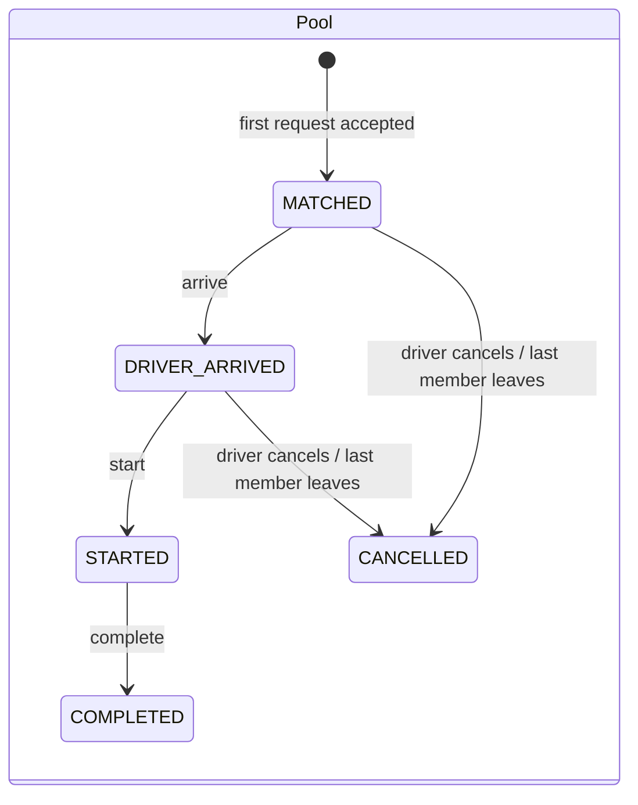

# Domain rules

Rules the code must implement exactly. Each rule is a pure function in `api/src/domain/` and has unit tests.

## The route line

All Teslas run one predefined line. Everyone boards at the start stop; a passenger can get off at any later stop.

| Sequence | Stop | Distance from start |
|---|---|---|
| 0 | Banani (start) | 0 km |
| 1 | Mohakhali | 3 km |
| 2 | Gulshan 1 | 5 km |
| 3 | Gulshan 2 | 7 km |
| 4 | Bashundhara | 10 km |

A trip is valid only if `pickup = start stop` and `drop.sequence > pickup.sequence`. Anything else → `400`.

## Lifecycle

There are two state machines. A **ride request** is one passenger's ride. A **pool** is one Tesla's trip, shared by
one or more ride requests.

**Why two instead of one:** Nusrat must be able to cancel without cancelling Jashim's trip for Rafiq.
Pool actions (arrive, start, complete, driver cancel) are applied to every active member in the same
transaction.





- A request can join a pool while the pool is `MATCHED` or `DRIVER_ARRIVED`. If it joins an arrived pool,
  the request goes straight to `DRIVER_ARRIVED`.
- Nothing can join, and no one can cancel, once the pool is `STARTED`.
- If the last active member cancels, the pool becomes `CANCELLED` and its seats are freed.
- A driver can't go offline while they have an active pool.
- Any transition not shown above → `409 INVALID_TRANSITION`.
- Every transition writes a `ride_status_history` row with the actor and optional reason.

## Matching

Because every valid trip is on the one line, any two passengers are route-compatible. Drop stops are
**not** compared with each other: Nusrat can get off at the next stop and Shirin at the last one.

A request can join a pool when all of these hold:

1. The request is `REQUESTED`.
2. The pool is `MATCHED` or `DRIVER_ARRIVED`.
3. `pool.seats_occupied + request.seats <= pool.capacity`.

The driver accepts each request individually. The first accept creates the Tesla's pool; later accepts add to it.
The driver's request list only shows requests whose seats fit the remaining capacity.

## Fare

All money is `INTEGER` poisha (৳1 = 100 poisha).

```
distanceCharge = distanceKm × 2000 × seats
poolDiscount   = pooled ? round(distanceCharge × 25 / 100) : 0
fare           = 3000 + distanceCharge − poolDiscount
```

- `distanceKm` = the drop stop's distance from the start.
- `pooled` = the pool has more than one active member **at the moment it moves to `STARTED`**. The fare
  breakdown is frozen then and charged at `COMPLETED`. If a co-rider cancels before the start, the
  remaining passenger pays the solo fare.
- At request time the passenger sees both the solo and the pooled estimate.

**Why integer poisha:** floats can't represent amounts like 0.1 exactly, so sums drift. `NUMERIC` would be exact
but is slower and easy to mishandle in JavaScript. Integers are exact, fast, and the only rounding step is
the discount.

### Hand-check (1 seat each)

| Passenger | Trip | Solo | Pooled |
|---|---|---|---|
| Nusrat | Banani → Mohakhali, 3 km | 3000 + 6000 = **9000 (৳90)** | 3000 + 6000 − 1500 = **7500 (৳75)** |
| Rafiq | Banani → Gulshan 1, 5 km | 3000 + 10000 = **13000 (৳130)** | 3000 + 10000 − 2500 = **10500 (৳105)** |
| Shirin | Banani → Gulshan 2, 7 km | 3000 + 14000 = **17000 (৳170)** | 3000 + 14000 − 3500 = **13500 (৳135)** |

## Payment

The passenger chooses the payment method per ride:

- **Cash**: a payment record is written at `COMPLETED`, marked as paid in cash.
- **TeslaPay wallet**:
  - At request time, the balance must cover the solo estimate, which is the highest possible fare.
  - At `COMPLETED`, the final fare is debited and a ledger row is written, in the same transaction.
  - `CHECK (balance_poisha >= 0)` is the final guard.
  - Top-ups are simulated.

## Cancellation

- A passenger can cancel their own ride in `REQUESTED`, `MATCHED` or `DRIVER_ARRIVED`. The seats are freed and the
  `pool_members.left_at` field is set.
- A driver can cancel the whole pool before `STARTED`, which cancels every active member.
- Nobody can cancel after `STARTED` → `409`.
- There is no cancellation fee.

## Authorization

- Passengers can only see or change their own rides. Another passenger's ride returns `404`, not `403`, so
  that ride IDs can't be probed.
- Passengers see their own fare and status, plus the number of co-riders. They never see co-riders' names or fares.
- Drivers can only act on their own Tesla's pool. They see member names, seats and drop stops.
- Role-restricted endpoints return `403` for the wrong role.

## Concurrency: the last-seat problem

**The scenario:** Bullet has one seat left (Rafiq holds 2 of 3). Nusrat and Shirin are both waiting, and Jashim's
two accept calls race (double tap, two tabs). Both calls initially see one free seat. A related race: an accept
landing at the same moment the passenger cancels.

**What we do: one transaction per accept** (`acceptRequest` in `api/src/modules/driver/driver.service.ts`).

1. `SELECT … FROM vehicles WHERE driver_id = $1 FOR UPDATE` locks the **Tesla's row**. A second accept for
   the same Tesla waits here until the first commits, then reads the updated seat count.
   The lock is on the vehicle rather than the pool because the vehicle row exists before the first pool does:
   locking "the active pool" would lock nothing when two accepts race to create it.
2. `SELECT … FROM pools WHERE id = $p FOR UPDATE` also locks the pool row, because a passenger cancelling
   locks only the pool.
3. `UPDATE pools SET seats_occupied = seats_occupied + $s WHERE id = $p AND seats_occupied + $s <= capacity`.
   If no row is updated → `409 CAPACITY_EXCEEDED`.
4. `UPDATE ride_requests SET status = 'MATCHED' WHERE id = $1 AND status = 'REQUESTED'`. If no row is updated,
   the passenger cancelled in the meantime → `409`, and the whole transaction (seats, new pool) rolls back.
5. Insert the `pool_members` and `ride_status_history` rows, then commit.

**Lock order** is always vehicle → pool → ride (`api/src/lib/locks.ts`). Every writer takes locks in that
order, so two transactions can wait for each other but never deadlock.

| Action | Locks |
|---|---|
| Driver accepts a request | vehicle → pool → ride (conditional update) |
| Driver arrives / starts / completes / cancels | vehicle → pool → rides |
| Driver goes offline | vehicle |
| Passenger cancels | pool → ride (conditional update, retried if the status changed) |

**Which layer stops which race** (checked by running the tests with the `FOR UPDATE`s removed):

- *Nusrat vs Shirin for the last seat:* the conditional seat `UPDATE` alone already gives exactly one
  winner. The row lock is a second layer on top.
- *Three first accepts on an empty Tesla:* only the vehicle lock turns this into one clean `200` and two
  `409`s. Without it, the one-active-pool index still stops a second pool, but the losing request fails as a
  500 instead of a clear `409`.

**Database guards**, which hold even if the application code has a bug:

- `CHECK (seats_occupied BETWEEN 0 AND capacity)` on `pools`.
- Partial unique index allowing one active pool per vehicle, so two "first accepts" can't create two pools.
- Partial unique index allowing one active ride request per passenger.

`api/tests/integration/pooling.test.ts` fires the racing requests with `Promise.all` for three cases: the last
seat, three first accepts, and cancel-vs-accept. Each checks that `seats_occupied` equals the sum of the
active members' seats and never exceeds capacity.

**At larger scale:** partition matching by route or area so locks stay local; add idempotency keys on
accept and request; use optimistic version columns where contention is low; move matching to a worker
consuming a per-area queue. Details are in the README's scaling section.

## Assumptions

1. Passengers and drivers both sign up. A driver registers their Tesla (name, unique plate, capacity 1–3)
   on the same form. Capacity can't be changed afterwards.
2. There is one route line; everyone boards at its start stop.
3. Each driver has one Tesla, each Tesla has at most one active pool, and each passenger has at most one active ride.
4. A request is for 1–3 seats. Seats multiply the distance charge; the base fare is charged once.
5. Requests don't expire (listed as a known limitation).
6. Co-riders are anonymous to each other.
