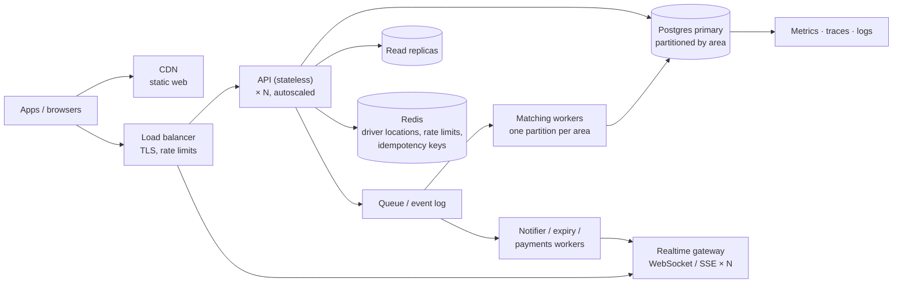

# If Oi Tesla goes viral: 1M passengers, 100k drivers

The MVP is one API process, one Postgres and polling. That's the right size for now, and nothing below is built.
This is how it would grow, in the order the pressure would arrive, and why each step comes when it does.

## The numbers that matter

- **Rides, not users, create load.** Say 1M passengers take 2 rides a day: about 2M rides per day, roughly
  23 per second on average and perhaps **200–300 per second at the 8–10 AM peak**. Each ride is about 10 writes
  (request, accept, 3 status changes, history, payment).
- **Polling is the hidden cost.** 100k online drivers and 200k riders mid-trip, each polling every 5 s, adds up to
  **60k reads per second**. This, not booking, is the first thing to break.
- **Contention is local.** A seat race involves one Tesla and the few passengers near it. There is no global
  hotspot, as long as nothing global is locked.

## Target architecture

## Step by step

**1. Stateless API behind a load balancer (first).** The API already keeps no session state (a JWT cookie) and
already works with several instances: locks live in Postgres, and the expiry sweep is a conditional update. Run
N copies and autoscale on CPU and p95 latency. Move the **rate limiter's counter to Redis** so the limit holds
across instances.

**2. Replace polling with push.** A realtime gateway (WebSocket, or SSE for passengers) that sends a message
on each status change. That turns 60k polling reads a second into a few hundred push events. The API publishes
`ride.status_changed` events and the gateway fans them out, so clients stop asking.

**3. Read replicas and caching.** History, receipts, earnings and stops go to **read replicas** (fine to be a
second behind). The route and stops rarely change, so cache them (CDN or in-memory). Writes and anything that checks
seats stay on the primary.

**4. Geography and matching.** Replace the single line with real locations:
- Drivers send their position every few seconds into **Redis GEO** (or H3 hexagon cells), not Postgres. It's
  high-churn data that doesn't need to be kept.
- Matching becomes "which online Teslas within X minutes are on a route compatible with this trip" (PostGIS
  for route geometry, the H3 cell for the candidate search).
- Matching moves to **workers, one partition per area** (e.g. an H3 cell or neighbourhood). Requests for an area go
  into that area's queue in order, so one worker owns each area. Seat races inside an area become sequential,
  and areas never block each other. The per-Tesla row lock stays as the final check.

**5. Database contention and partitioning.** Seat updates already lock per Tesla, not per table. Next:
- **Partition** `ride_requests`, `ride_status_history` and `wallet_transactions` by time (monthly) so indexes stay small
  and old data can be archived.
- If one primary is still too small, **shard by city or area**. A ride never crosses areas in this model, so
  transactions stay on one shard.
- Keep the partial unique indexes and CHECKs: they're the last line of defence at any scale.

**6. Idempotency and retries.** Mobile networks retry. Booking, accept, complete and top-up take an
**`Idempotency-Key`** header, and the result is stored against it (Redis, plus a table for money operations), so a retry
returns the first answer instead of doing the work twice. Today "one active ride per passenger" already makes a
double booking harmless. Keys generalise that. Client retries use exponential backoff with jitter. Workers retry
from the queue, with a dead-letter queue for anything that keeps failing.

**7. Queues and events, where they earn their place.** Not for booking itself (the passenger needs an answer
now), but for work that can happen a moment later:
- notifications
- expiry (a delayed message per request replaces the sweeper)
- payment settlement and receipts
- analytics

An outbox table written in the same transaction as the status change guarantees an event is published exactly
when the change commits.

**8. Payments.** Settlement moves to a payments service with a double-entry ledger (the `wallet_transactions`
ledger is the start of one). A real gateway would be integrated via idempotent webhooks, with daily
reconciliation.

**9. Rate limiting and abuse.** At the edge (per IP) and in the API (per user, per endpoint). Tighter limits on
booking and accept. Bot protection on sign-up.

**10. Observability.** Structured logs already carry request ids. Add **OpenTelemetry traces** across API →
queue → workers, and metrics for:
- matching time and accept rate
- seat conflicts (409s) and expired requests per area
- lock wait time and p95/p99 per endpoint

Alert on what riders feel: time to match, and failed payments.

**11. Security.** Short-lived access tokens plus refresh tokens with revocation (server-side session list).
Secrets in a secret manager; least-privilege database roles; PII (phone, location history) encrypted and kept
for a limited time; audit logs for driver and admin actions.

**12. Deployment.**
- Containers (the same Dockerfiles) on a managed platform (ECS, Cloud Run or Kubernetes, only once there are enough
  services to need it).
- Blue/green or canary releases.
- Database migrations that are backwards compatible (expand, then contract), so old and new API versions can
  run side by side during a rollout.
- Several availability zones, and one region close to Dhaka.

## What stays the same

The domain rules (`api/src/domain/`), the two state machines, integer money, the database constraints and the
lock order are designed to survive all of this unchanged. Scaling moves where the work happens, not what the
rules are.
